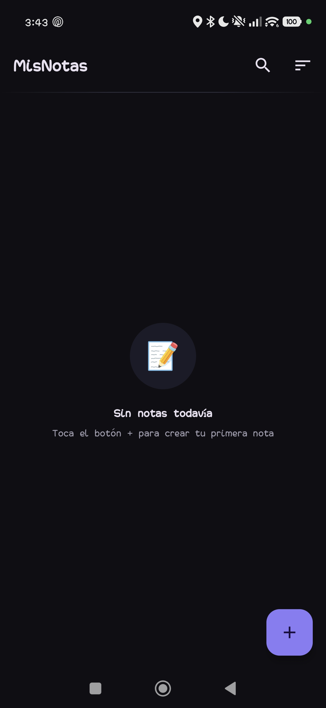
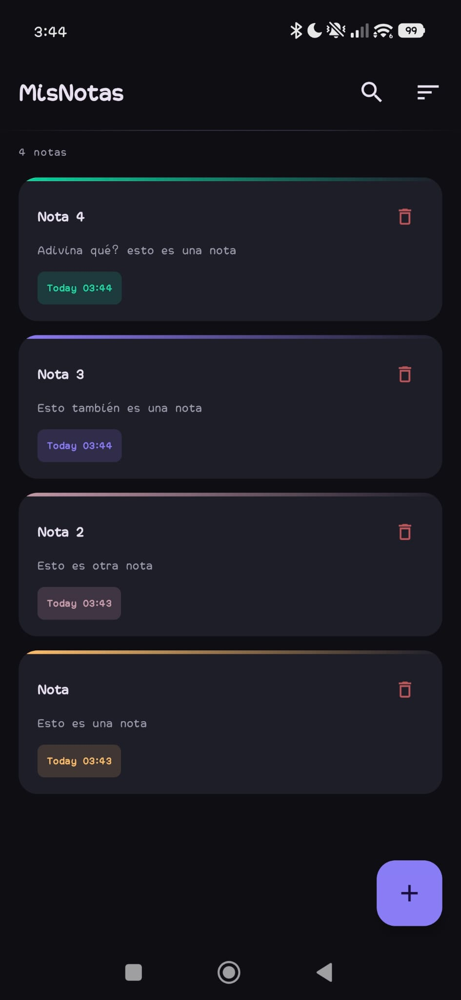
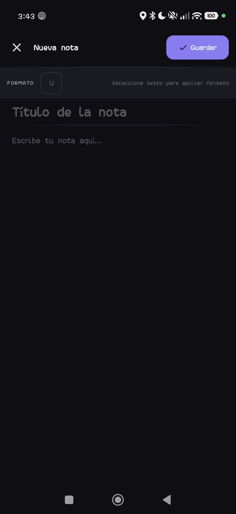
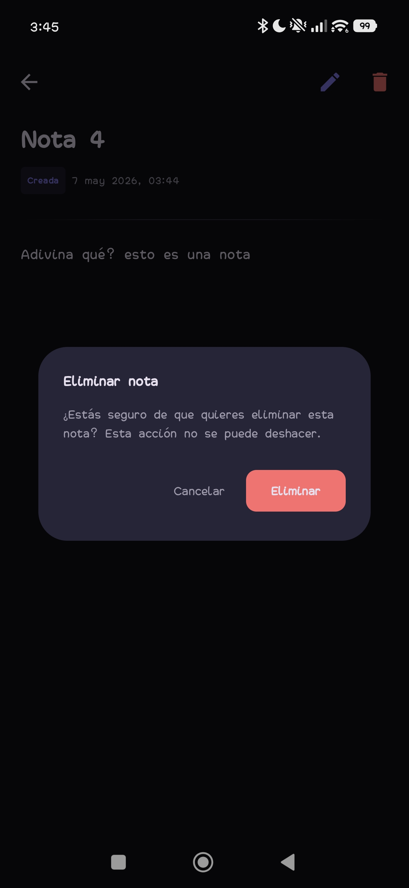
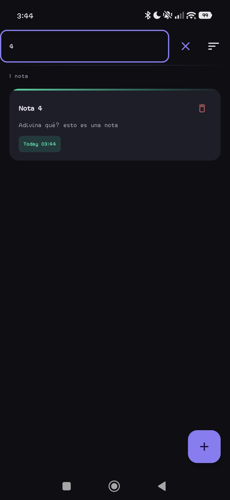
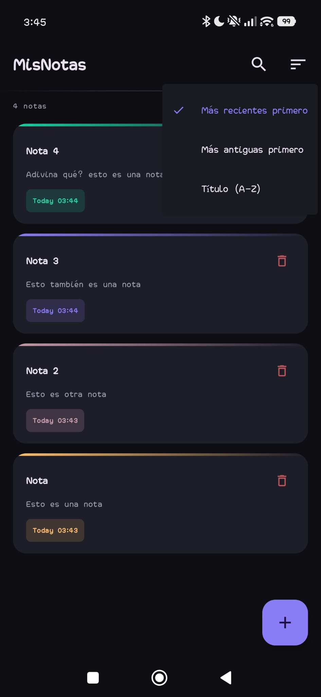

# MisNotas 📝

**MisNotas** es una aplicación Android nativa para tomar notas con soporte de **texto enriquecido (subrayado)**, construida con tecnologías modernas de desarrollo. Permite crear, leer, editar, buscar y eliminar notas de forma rápida e intuitiva, todo envuelto en un atractivo tema oscuro.

---

## ✨ Funcionalidades



### 1. Lista de notas con búsqueda y ordenación
- Visualiza todas tus notas en una lista con **vista previa del contenido** y **fecha de modificación**.
- **Búsqueda instantánea** por título o contenido, con un campo expandible en la barra superior.
- Opciones de **ordenación**: más recientes, más antiguas o por título (A-Z).



### 2. Crear y editar notas con texto enriquecido
- Editor con campos separados para **título** y **contenido**.
- El contenido soporta **formato de subrayado** mediante un formato HTML interno (`<u>texto</u>`).
- Barra de herramientas de formato que se activa al seleccionar texto, mostrando el estado actual del subrayado.
- Interfaz limpia y enfocada en la escritura, con placeholders y divisores visuales.



### 3. Detalle de nota y eliminacion con confirmacion
- Visualización completa de la nota con el título, fechas de creación y edición, y el contenido enriquecido renderizado con los subrayados aplicados.
- Acceso rápido a **editar** o **eliminar** desde la barra superior.
- Cada nota en la lista tiene un botón de eliminar con un **diálogo de confirmación** para evitar borrados accidentales.
- La eliminación desde el detalle también muestra el mismo diálogo de seguridad.



### 5. Búsqueda y ordenación inteligentes
- Búsqueda con **debounce** de 300ms para no saturar la base de datos mientras escribes.
- El menú de ordenación muestra la opción activa con un icono de verificación.
- Al limpiar la búsqueda, se recupera automáticamente la lista completa.





### 6. Animaciones y experiencia de usuario
- Transiciones animadas entre pantallas (deslizamiento lateral y vertical).
- Animaciones sutiles en el FAB y en los botones de la barra de formato.
- Indicador de carga al guardar notas.
- Placeholder animado cuando no hay notas.

---

## 🏗️ Arquitectura

La aplicación sigue una arquitectura limpia (**Clean Architecture**) simplificada con el patrón **MVVM** (Model-View-ViewModel) y está modularizada en tres capas principales:

| Capa          | Responsabilidad                                                                                  |
|---------------|--------------------------------------------------------------------------------------------------|
| **data**      | Fuente de datos local con Room. Contiene entidades, DAOs, la base de datos y la implementación del repositorio. |
| **domain**    | Modelos de dominio (Note), interfaces de repositorio y casos de uso. No depende de frameworks.   |
| **presentation** | Pantallas Compose, ViewModels y componentes reutilizables. Usa Hilt para inyección de dependencias. |

### Flujo de datos
UI (Compose) → ViewModel → Casos de uso → Repositorio → Room (DAO) → SQLite

### Gestión de dependencias
Se utiliza **Dagger Hilt** para la inyección de dependencias en todas las capas:

- `DatabaseModule`: provee la base de datos Room y el DAO.
- `RepositoryModule`: enlaza la interfaz del repositorio con su implementación.
- Los ViewModels se obtienen con `@HiltViewModel` e inyectan los casos de uso necesarios.

---

## 📁 Estructura del proyecto

```text
com.noteapp/
├── di/ # Módulos Hilt
│ ├── DatabaseModule.kt
│ └── RepositoryModule.kt
├── data/
│ ├── local/
│ │ ├── dao/NoteDao.kt # Operaciones SQL sobre notas
│ │ ├── entity/NoteEntity.kt # Entidad Room
│ │ └── NoteDatabase.kt # Definición de la BD
│ └── repository/NoteRepositoryImpl.kt
├── domain/
│ ├── model/Note.kt # Modelo de dominio
│ ├── repository/NoteRepository.kt
│ └── usecase/NoteUseCases.kt # Casos de uso (CRUD, búsqueda)
├── presentation/
│ ├── components/SharedComponents.kt # FAB, diálogos, dividers, etc.
│ ├── navigation/NoteNavGraph.kt # Navegación con NavHost
│ ├── screens/
│ │ ├── detail/NoteDetailScreen.kt + ViewModel
│ │ ├── edit/NoteEditScreen.kt + ViewModel
│ │ └── list/NoteListScreen.kt + ViewModel
│ └── theme/
│ ├── Color.kt
│ ├── Theme.kt
│ └── Type.kt
├── util/
│ ├── DateUtils.kt # Formateo de fechas
│ └── RichTextUtils.kt # Conversión HTML ↔ AnnotatedString
├── MainActivity.kt
└── NoteApplication.kt
```

---

## 🛠️ Tecnologías utilizadas

| Tecnología            | Uso principal                                    |
|-----------------------|--------------------------------------------------|
| **Kotlin**            | Lenguaje de programación                         |
| **Jetpack Compose**   | UI declarativa moderna                           |
| **Room**              | Persistencia local (SQLite)                      |
| **Hilt**              | Inyección de dependencias                        |
| **Navigation Compose**| Navegación entre pantallas con animaciones       |
| **Flow & corrutinas** | Programación reactiva y asíncrona                |
| **Material 3**        | Componentes visuales y tema oscuro personalizado |

---

## ▶️ Cómo ejecutar

1. Clona el repositorio.
2. Abre el proyecto en **Android Studio Hedgehog o superior**.
3. Sincroniza los archivos Gradle.
4. Ejecuta en un emulador o dispositivo con **API 26+**.
5. Para generar las capturas, puedes usar la herramienta integrada de Android Studio o `adb`.

---

## 🚀 Posibles mejoras futuras

- [ ] Soporte para **negrita**, *cursiva* y otros formatos.
- [ ] Sincronización en la nube (Firebase / propia API).
- [ ] Adjuntar imágenes o archivos a las notas.
- [ ] Notificaciones y recordatorios.
- [ ] Widget en la pantalla de inicio.
- [ ] Modo claro/claro-oscuro automático.

---

## 📄 Licencia

Este proyecto se distribuye bajo la licencia MIT.

---

¿Dudas o sugerencias? ¡Las contribuciones son bienvenidas!
